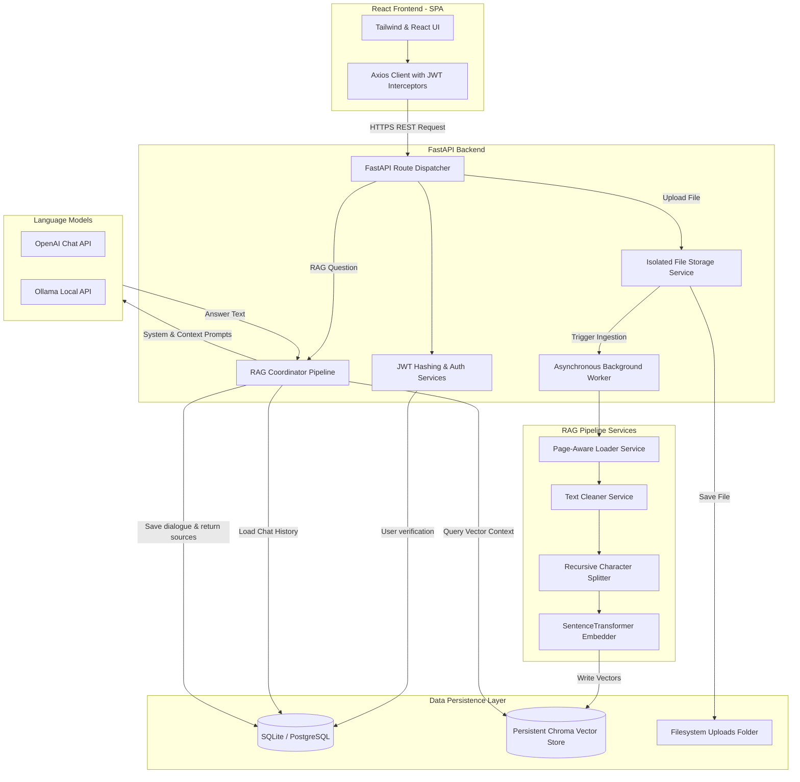

# Antigravity RAG: Production-Ready Document Q&A System

Antigravity RAG is an enterprise-grade, multi-user Retrieval-Augmented Generation (RAG) Document Q&A System. It isolates user collections at the database and vector levels, parses documents page-by-page to generate exact citations, and executes semantic retrieval via local Sentence Transformer embeddings and ChromaDB.

---

## System Architecture



### Key Technical Specs
- **Backend Framework**: FastAPI (Asynchronous routing, type validation, automatic Swagger docs).
- **Frontend Toolchain**: Vite React TS + Tailwind CSS v3 (Light/Dark glassmorphic layout).
- **Vector Database**: ChromaDB (Cosine similarity metrics on localized HNSW indices).
- **Embedding Model**: `all-MiniLM-L6-v2` via SentenceTransformers (local CPU/GPU execution).
- **Authentication**: Stateless JWT Bearer tokens, password storage hashed with `bcrypt`.
- **Database**: SQLite (local development) / PostgreSQL (production connection pooling).
- **Background Tasks**: In-process thread-pool offloading utilizing FastAPI `BackgroundTasks`.

---

## Directory Structure

```
├── backend/
│   ├── app/
│   │   ├── api/          # FastAPI v1 routing endpoints
│   │   ├── auth/         # JWT generation and login dependencies
│   │   ├── chat/         # SQL dialogue routers
│   │   ├── config/       # Pydantic Settings loaders
│   │   ├── core/         # Structured logging configurations & exceptions
│   │   ├── database/     # DB engine and session configurations
│   │   ├── models/       # SQLAlchemy relational schemas
│   │   ├── schemas/      # Pydantic models for request/response shapes
│   │   ├── services/     # Storage, Loaders, Cleaners, Embeddings, Chroma DB
│   │   └── tests/        # Pytest test cases
│   ├── Dockerfile
│   ├── pyproject.toml
│   └── requirements.txt
├── frontend/
│   ├── src/
│   │   ├── context/      # Auth & Theme React contexts
│   │   ├── services/     # Axios wrappers
│   │   ├── views/        # Login, Register, Dashboard views
│   │   ├── App.tsx       # Routing maps
│   │   └── index.css     # Tailwind directives and scrollbar resets
│   ├── Dockerfile
│   └── tailwind.config.js
└── docker-compose.yml
```

---

## Setup & Running Guide

### Method A: Single Command Run (Recommended)
Make sure you have Docker and Docker Compose installed.

1. **Configure Environment Variables**:
   Create a `.env` file inside the `backend` folder:
   ```bash
   cp backend/.env.example backend/.env
   ```
   Fill in your OpenAI API Key:
   ```env
   LLM_API_KEY="your-openai-api-key"
   ```

2. **Launch Container Services**:
   At the root of the project workspace, run:
   ```bash
   docker compose up --build
   ```

3. **Access Services**:
   - **Frontend App**: `http://localhost` (exposes React dashboard on standard port 80).
   - **Backend API Docs**: `http://localhost:8000/docs` (Swagger UI for endpoint testing).

---

### Method B: Manual Bare-Metal Installation

#### 1. Backend Server Setup
- Requires Python 3.12+ installed.
- Open a terminal and navigate to the `backend` directory:
  ```bash
  cd backend
  python -m venv venv
  # Activate venv:
  # On Windows (PowerShell):
  .\venv\Scripts\Activate.ps1
  # On Linux/macOS:
  source venv/bin/activate
  ```
- Install dependencies:
  ```bash
  pip install -r requirements.txt
  ```
- Copy and customize your environment configuration:
  ```bash
  cp .env.example .env
  ```
- Start the API server:
  ```bash
  python app/main.py
  ```

#### 2. Frontend Client Setup
- Requires Node.js 20+ installed.
- Open a separate terminal and navigate to the `frontend` directory:
  ```bash
  cd frontend
  npm install
  ```
- Start the Vite development hot-reload server:
  ```bash
  npm run dev
  ```
- Access the local hot-reload client at `http://localhost:5173`.

---

## Detailed REST API Documentation

All routes are version-controlled with the `/api/v1` prefix.

| Method | Endpoint | Auth | Description |
|--------|----------|------|-------------|
| **POST** | `/api/v1/auth/register` | Public | Registers a new user. Expects `email`, `password`. |
| **POST** | `/api/v1/auth/login` | Public | Authenticates credentials and returns a JWT token. |
| **GET** | `/api/v1/auth/me` | JWT | Returns user profile details. |
| **POST** | `/api/v1/documents/upload` | JWT | Uploads file. Immediately queues background workers. |
| **GET** | `/api/v1/documents/` | JWT | Lists all user uploaded files and their statuses. |
| **DELETE**| `/api/v1/documents/{id}` | JWT | Wipes file from disk, SQLite, and Chroma index. |
| **POST** | `/api/v1/chat/sessions` | JWT | Starts a new dialogue thread. |
| **GET** | `/api/v1/chat/sessions` | JWT | Lists user's conversations histories. |
| **POST** | `/api/v1/chat/sessions/{id}/ask` | JWT | Executes vector retrieval and LLM context prompt. |
| **GET** | `/api/v1/health` | Public | System liveness probe checking DB, Chroma, and Disk status. |

---

## Troubleshooting Guide

### 1. File Uploads show `FAILED` status
- **Root Cause**: The local Sentence Transformers embedding model is downloading on first run. If your network connection drops or has a timeout, the background worker throws an exception.
- **Resolution**: Monitor the logs in `backend/logs/app.log` or Docker logs. The system will automatically download `all-MiniLM-L6-v2` (~90MB) on the first document upload. Ensure your internet connection is active during first indexing.

### 2. Frontend requests show CORS errors
- **Root Cause**: The React client is running on a port not whitelisted in `main.py` CORS setup, or browser is caching stale network paths.
- **Resolution**: The default settings allow `*` (all origins) in development. Ensure your API queries are calling `http://localhost:8000/api/v1/`.

### 3. Pytest command fails
- **Root Cause**: Running tests from outside the `backend/` directory triggers module path errors.
- **Resolution**: Always run `cd backend` first, then run `python -m pytest` or `pytest`. This binds paths to the correct configuration modules.
